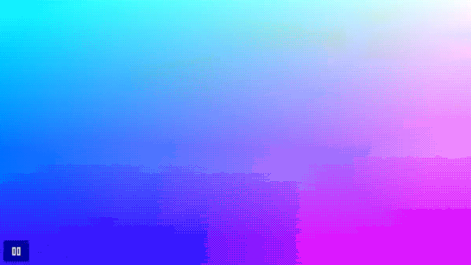

# GLSL Viewer Plugin for Obsidian

A GLSL shader preview plugin for Obsidian that enables real-time WebGL rendering with Shadertoy-style shader code.

## Features

- 📦 Shadertoy-compatible GLSL shader execution
- 🎮 Play/pause controls
- 🖼️ Texture loading (iChannel0-3)
- ⚙️ Configurable canvas ratio
- 🔧 In-code block configuration
- 🎨 Template system for complex shader patterns

## Demo



## Installation

1. Copy this plugin to your Obsidian plugins folder
2. Enable the plugin in Obsidian settings

## Usage

**Primary**: Create a code block with `glsl-viewer` language:

### Basic Example
````markdown
```glsl-viewer
void mainImage(out vec4 fragColor, in vec2 fragCoord) {
    vec2 uv = fragCoord / iResolution.xy;
    vec3 col = 0.5 + 0.5 * cos(iTime + uv.xxy + vec3(0, 2, 4));
    fragColor = vec4(col, 1.0);
}
```
````

### Setting Example
````markdown

```glsl-viewer
// @aspect: 1.0
// @autoplay: true
// @iChannel0: assets/images/texture.jpg
void mainImage(out vec4 fragColor, in vec2 fragCoord) {
    vec2 uv = (fragCoord-iResolution.xy*.5) / iResolution.y;
    uv+=vec2(sin(iTime),cos(iTime));
    vec3 texColor = texture(iChannel0, uv * 2.0).rgb;
    vec3 col = texColor;
	fragColor = vec4(col, 1.0);
}
```
````

### Template Example

Templates enable complex shader patterns with minimal code. Create custom templates in `.obsidian/plugins/glsl-viewer/templates/`:

````markdown
```glsl-viewer
// @template: raymarching.glsl
// @autoplay: false

vec4 map(vec3 p) {
    float d = length(p) - 0.5;  // Sphere distance function
    return vec4(d, COL_S2);     // Return distance and material color
}
```
````

**Template Benefits:**
- **Minimal code**: Write only the essential function (e.g., `map` for raymarching)
- **Reusable**: Share complex setups across multiple shaders
- **Customizable**: Create your own templates with `@TEMPLATE_LINES` placeholder

### Texture Path Formats

| Path Type | Example | Description |
|-----------|---------|-------------|
| **Vault-relative** | `images/texture.jpg` | Relative to vault root |
| **Subfolder** | `assets/textures/noise.png` | Files in subfolders |

## Configuration Options

### Comment Settings

| Setting | Description | Default |
|---------|-------------|---------|
| `@aspect: number` | Canvas aspect ratio (height/width) | 0.5625 |
| `@autoplay: true/false` | Auto-start animation | false |
| `@template: filename` | Use template from templates folder | - |
| `@iChannel0: path` | Texture file path | - |
| `@iChannel1: path` | Texture file path | - |
| `@iChannel2: path` | Texture file path | - |
| `@iChannel3: path` | Texture file path | - |

### Available Uniforms

- `vec3 iResolution` - Screen resolution ✅
- `float iTime` - Elapsed time ✅
- `float iTimeDelta` - Frame delta time ✅
- `int iFrame` - Frame number ✅
- `vec4 iMouse` - Mouse position (Shadertoy-compatible) ✅
- `vec4 iDate` - Date info (year, month, day, seconds) ✅
- `sampler2D iChannel0-3` - Textures ✅

## Technical Details

- **Rendering**: Pure WebGL implementation (no external dependencies)
- **Shader Type**: Fragment shaders only
- **Entry Point**: `mainImage(out vec4 fragColor, in vec2 fragCoord)`
- **Textures**: Obsidian vault files supported
- **Templates**: Custom templates with `@TEMPLATE_LINES` placeholder replacement
- **Performance**: Configurable concurrent shader limit

### Plugin Settings

Access via Settings → Community plugins → GLSL Viewer:

- **Maximum Active Viewers**: Performance control (1-50)
- **Default Aspect Ratio**: Canvas ratio for new shaders
- **Default Textures**: Auto-loaded textures for iChannel0-3

### Creating Custom Templates

1. Create a `.glsl` file in `.obsidian/plugins/glsl-viewer/templates/`
2. Use `@TEMPLATE_LINES` placeholder where user code should be inserted
3. Reference the template with `// @template: filename.glsl`

**Example template** (`raymarching.glsl`):
```glsl
// Raymarching template with lighting and camera
uniform vec3 iResolution;
uniform float iTime;

vec3 camera(vec2 uv) { /* camera logic */ }

@TEMPLATE_LINES  // User's map() function goes here

void mainImage(out vec4 fragColor, in vec2 fragCoord) {
    // Full raymarching pipeline
}
```

## Development

```bash
npm install
npm run dev    # Development mode
npm run build  # Production build
```

## License

MIT License

## Compatibility

- **Obsidian**: v1.0.0+
