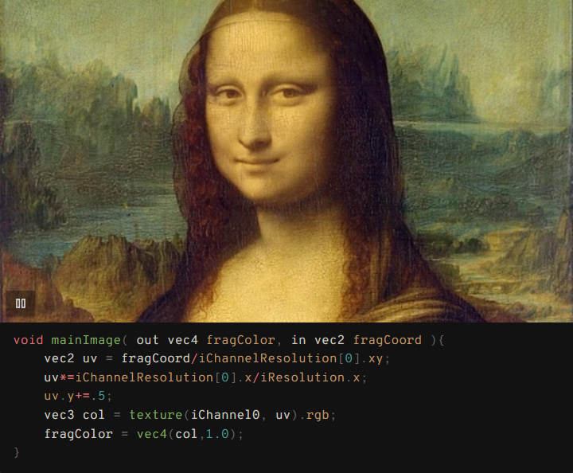

# GLSL Viewer Plugin for Obsidian

A GLSL shader preview plugin for Obsidian that enables real-time WebGL rendering with Shadertoy-style shader code.
</br></br></br>
## Features


### Shadertoy Compatibility  _(Limited)_


*Same syntax as Shadertoy - easily port your creations and reuse code snippets between platforms*

### Custom Textures


*Load images from your vault as textures (iChannel0-3)*

### Template System


*Use templates to simplify complex shaders - write minimal code, get maximum results*

### And more
- 📸 Thumbnail generation for non-autoplay shaders
- ⚙️ Configurable canvas ratio, autoplay, and code visibility
- 🔧 Flexible configuration using comments in code blocks
- 🎯 **Texture shortcuts**: Quick reference to frequently used textures
- 📁 **Texture browser**: Visual texture selection with folder filtering
- 🙈 **@hideCode**: Show only the viewer or with code
- 🎯 **Works with syntax highlighters**: No conflicts with other code plugins (Shiki Highlighter)
</br></br></br>
## Installation

1. Copy this plugin to your Obsidian plugins folder
2. Enable the plugin in Obsidian settings
</br></br></br>
## Usage
Use standard `glsl` code blocks with `@viewer` directive:

### **Directive Styles:**

**Single-line comments:**
````glsl
```glsl
// @viewer
// @aspect: 0.75
// @autoplay: true
void mainImage(out vec4 fragColor, in vec2 fragCoord) {
    vec2 uv = fragCoord / iResolution.xy;
    vec3 col = 0.5 + 0.5 * cos(iTime + uv.xxy + vec3(0, 2, 4));
    fragColor = vec4(col, 1.0);
}
```
````

**Multi-line comments**:
````glsl
```glsl
/*
@viewer
@aspect: 0.75
@autoplay: true
@hideCode: true
@iChannel0: assets/texture.png
*/
void mainImage(out vec4 fragColor, in vec2 fragCoord) {
    vec2 uv = fragCoord / iResolution.xy;
    vec3 col = 0.5 + 0.5 * cos(iTime + uv.xxy + vec3(0, 2, 4));
    fragColor = vec4(col, 1.0);
}
```
````

### Basic Example
````glsl
```glsl
// @viewer
void mainImage(out vec4 fragColor, in vec2 fragCoord) {
    vec2 uv = fragCoord / iResolution.xy;
    vec3 col = 0.5 + 0.5 * cos(iTime + uv.xxy + vec3(0, 2, 4));
    fragColor = vec4(col, 1.0);
}
```
````

### Setting Example
````glsl

```glsl
// @viewer
// @aspect: 1.0
// @autoplay: true
// @iChannel0: assets/images/texture.jpg
// @hideCode: true
void mainImage(out vec4 fragColor, in vec2 fragCoord) {
    vec2 uv = (fragCoord-iResolution.xy*.5) / iResolution.y;
    uv+=vec2(sin(iTime),cos(iTime));
    vec3 texColor = texture(iChannel0, uv * 2.0).rgb;
    vec3 col = texColor;
    fragColor = vec4(col, 1.0);
}
```
````

### Template Example

Templates enable the creation of complex shader patterns with minimal code.</br>
Create custom templates in `.obsidian/plugins/glsl-viewer/templates/`.</br>
Share complex setups across multiple shaders.

````glsl
```glsl
// @viewer
// @template: raymarching.glsl
vec4 map(vec3 p) {
    float d = length(p) - 0.5;  // Sphere distance function
    return vec4(d, COL_S2);     // Return distance and material color
}
```
````

### Texture Path Formats

| Path Type | Example | Description |
|-----------|---------|-------------|
| **Vault-relative** | `images/texture.jpg` | Relative to vault root |
| **Shortcut Key** | `tex1` | Pre-configured texture shortcuts |

### Texture Shortcuts

Create shortcuts for frequently used textures in plugin settings.</br>
Instead of typing full paths, use short keys:

````glsl
```glsl
// @viewer
// @iChannel0: tex1      // Uses shortcut 'tex1'
// @iChannel1: noise     // Uses shortcut 'noise'
void mainImage(out vec4 fragColor, in vec2 fragCoord) {
    vec2 uv = fragCoord / iResolution.xy;
    vec3 tex = texture(iChannel0, uv).rgb;    // 'tex1' texture
    vec3 n = texture(iChannel1, uv).rgb;      // 'noise' texture
    fragColor = vec4(mix(tex, n, 0.5), 1.0);
}
```
````

**Configure shortcuts in Settings → GLSL Viewer → Textures → Texture Shortcuts**

### Texture Resolution Access

Access texture dimensions using `iChannelResolution[channel]` uniform:</br>
Each channel provides a `vec3` with (width, height, z_component).</br>
**Note**: Only 2D textures are supported. The z component is always 1.0 for Shadertoy compatibility.

````glsl
```glsl
// @viewer
// @iChannel0: tex1
void mainImage(out vec4 fragColor, in vec2 fragCoord) {
    vec2 uv = fragCoord / iResolution.xy;

    // Get texture resolution for iChannel0
    vec3 texRes = iChannelResolution[0];
    float texWidth = texRes.x;      // Texture width in pixels
    float texHeight = texRes.y;     // Texture height in pixels
    // texRes.z is always 1.0 (reserved for 3D textures, but only 2D supported)

    // Calculate aspect ratio for UV scaling
    float texAspect = texWidth / texHeight;
    vec2 scaledUV = uv * (iResolution.xy / texRes.xy);
    vec3 color = texture(iChannel0, scaledUV).rgb;

    fragColor = vec4(color, 1.0);
}
```
````

</br></br></br>
## Configuration Options

### Comment Settings

| Setting | Description | Default |
|---------|-------------|---------|
| `@viewer` | Enable viewer for `glsl` code blocks | - |
| `@aspect: number` | Canvas aspect ratio (height/width) | 0.5625 |
| `@autoplay: true/false` | Auto-start animation | false |
| `@hideCode: true/false` | Hide code block, show viewer only | false |
| `@template: filename` | Use template from templates folder | - |
| `@iChannel0: path` | Texture file path | - |
| `@iChannel1: path` | Texture file path | - |
| `@iChannel2: path` | Texture file path | - |
| `@iChannel3: path` | Texture file path | - |

**Note**: `@viewer` directive is required only for `glsl` code blocks. `glsl-viewer` blocks are always processed.

### Available Uniforms

- `vec3 iResolution` - Screen resolution ✅
- `float iTime` - Elapsed time ✅
- `float iTimeDelta` - Frame delta time ✅
- `int iFrame` - Frame number ✅
- `vec4 iMouse` - Mouse position (Shadertoy-compatible) ✅
- `vec4 iDate` - Date info (year, month, day, seconds) ✅
- `sampler2D iChannel0-3` - Textures ✅
- `vec3 iChannelResolution[4]` - Texture resolutions (width, height, 1.0) ✅

</br></br></br>

## Technical Details

- **Rendering**: Pure WebGL implementation
- **Shader Type**: Fragment shaders only
- **Entry Point**: `mainImage(out vec4 fragColor, in vec2 fragCoord)`
- **Textures**: Load images from anywhere in your vault
- **Templates**: Custom templates with `@TEMPLATE_LINES` placeholder replacement
- **Performance**: Configurable concurrent shader limit

### Plugin Settings

Access via Settings → Community plugins → GLSL Viewer:

**Performance Settings:**
- **Maximum Active Viewers**: Performance control (1-50)

**Display Settings:**
- **Default Aspect Ratio**: Canvas ratio for new shaders
- **Default Autoplay**: Whether new shaders auto-start by default
- **Default Hide Code**: Whether to hide code blocks by default

**Textures:**
- **Texture Folder**: Limit texture browsing to specific folder
- **iChannels Default**: Auto-loaded textures for iChannel0-3
- **Texture Shortcuts**: Create shortcuts for frequently used textures

### Creating Custom Templates

1. Create a `.glsl` file in `.obsidian/plugins/glsl-viewer/templates/`
2. Use `@TEMPLATE_LINES` placeholder where user code should be inserted
3. Reference the template with `// @template: filename.glsl`

**Example template** (`raymarching.glsl`):
```glsl
// Raymarching template with lighting and camera
uniform vec3 iResolution;
uniform float iTime;

vec3 camera(vec2 uv) { /* camera logic */ }

@TEMPLATE_LINES  // User's map() function goes here

void mainImage(out vec4 fragColor, in vec2 fragCoord) {
    // Full raymarching pipeline
}
```
</br></br></br>
## Development

```bash
npm install
npm run dev    # Development mode
npm run build  # Production build
```
</br></br></br>
## License

MIT License
</br></br></br>
## Compatibility

- **Obsidian**: v1.0.0+
- **Shiki-highlighter**
